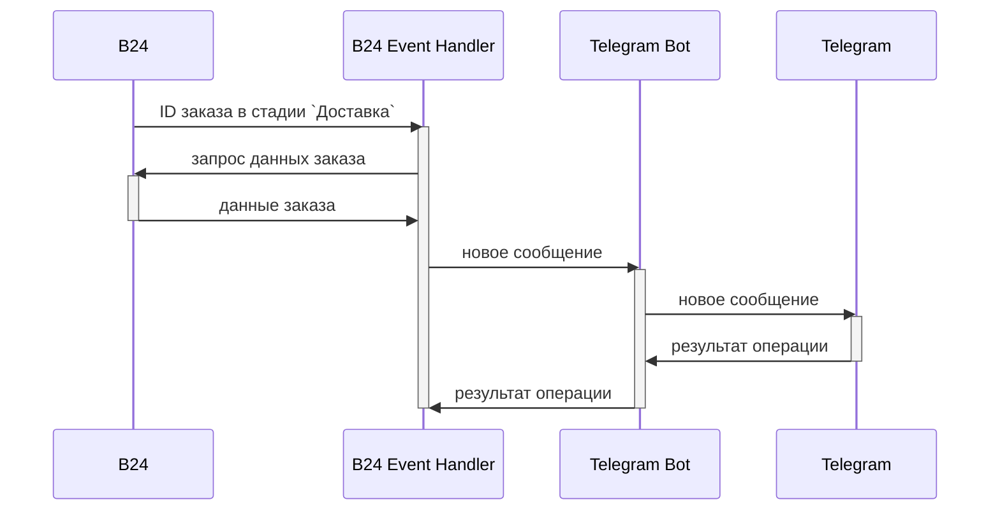

# Сервис уведомлений Telegram
## Описание проблемы
У нас есть условный заказчик, который занимается онлайн продажей 
велосипедов. Контроль и обработка заказов ведется в специальной
системе учета ([Битрикс24](https://www.bitrix24.ru/)), в которой 
каждому заказу в конкретный момент времени соответствует одна из 
стадий:
1. Новый заказ
1. В обработке
1. Доставка
1. Доставлен

По ряду причин, как исторических, так и из цели элементарной экономии,
отдел доставки не использует систему учета, вместо которой
предпочитает пользоваться чатом в Telegram. Когда заказ попадает
на стадию 'Доставка' в системе учета, менеджер формирует текст 
сообщения и отправляет его в соответствующий чат Telegram. А отдел 
доставки уже подхватывает это сообщение и берет заказ в доставку. Все 
данные, которые менеджер использует для отправки сообщения доступны 
в карточке соответствующего заказа в учетной системе.

Таким образом, менеджер каждый раз выполняет однообразную работу,
которая может быть автоматизирована, что нам и предстоит выполнить.

## Ограничения
Так как у нас крайне экономный заказчик, нам необходимо выполнить 
эту автоматизацию без привлечения каких-либо сторонних платных
решений, которые, как правило, предоставляют 
[no-code](https://en.wikipedia.org/wiki/No-code_development_platform) 
средства для выполнения сравнительно простых интеграций разных сервисов 
между собой. Примеры таких решений:
- [Zapier](https://zapier.com/)
- [IFTTT](https://ifttt.com/)
- [Albato](https://albato.ru/)

## Архитектура системы
Было принято решение использовать следующую архитектуру для решения
нашей задачи:
1. B24 - [Битрикс24](https://www.bitrix24.ru/), учетная система заказов
1. B24 Event Handler - [веб-сервис](https://en.wikipedia.org/wiki/Web_service),
принимающий и обрабатывающий события от Битрикс24
1. Telegram Bot - [веб-сервис](https://en.wikipedia.org/wiki/Web_service),
принимающий запросы на отправку новых сообщений в Telegram и реализующий такую 
отправку с помощью [Telegram Bot API](https://core.telegram.org/bots/api)
1. Telegram - сервер, реализующий интерфейс 
[Telegram Bot API](https://core.telegram.org/bots/api), фактически позволяющий
взаимодействовать с чатами Telegram

## План работ
### Telegram Bot
Это основная задача в рамках текущего проекта - реализация 
[веб-сервиса](https://en.wikipedia.org/wiki/Web_service) для непосредственной
отправки сообщений в Telegram.

Реализация этого сервиса состоит из двух этапов:
1. Реализация Telegram бота, который позволит отправлять сообщения в 
Telegram
1. Реализация обертки вокруг Telegram бота, которая позволят с помощью
HTTP запросов инициировать отправку сообщения в Telegram

### B24 Event Handler *
Это дополнительная задача, которую можно реализовать по желанию. Эталонная
реализация будет предоставлена, поэтому для полноценного теста всей системы 
выполнять эту задачу необязательно.