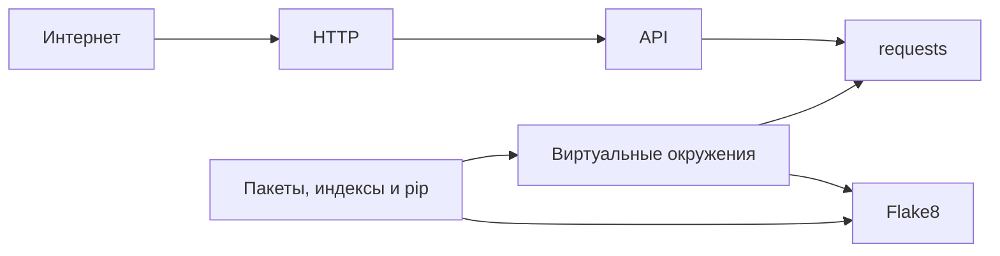

# Sprint 1
Первый спринт, в рамках которого мы заложим необходимую уверенность в работе с 
сетью и настроим минимальное окружение для удобного, изолированного использования 
в своих проектах сторонних библиотек, а так же настроим базовое средство контроля
качества кода.

Часть тем можно изучать в асинхронном режиме, более того, это настоятельно
рекомендуется. 
[Граф зависимостей](https://ru.wikipedia.org/wiki/%D0%93%D1%80%D0%B0%D1%84_%D0%B7%D0%B0%D0%B2%D0%B8%D1%81%D0%B8%D0%BC%D0%BE%D1%81%D1%82%D0%B5%D0%B9) тем представлен ниже.

## Интернет, HTTP, API, requests
Согласно архитектуре проекта, у нас есть четыре самостоятельных сервиса, часть из
которых расположены на разных компьютерах. При этом, эти сервисы должны согласованно 
работать путем обмена сообщениями в той или иной форме.
Мы знаем, что для обмена данными между компьютерами используется 
[компьютерная сеть](https://en.wikipedia.org/wiki/Computer_network). Следовательно,
нам необходимо, чтобы все наши сервисы были в том или ином виде подключены к какой-то
компьютерной сети. Такой компьютерной сетью, точнее сетью сетей, является 
[интернет](https://en.wikipedia.org/wiki/Internet). Кроме всего прочего, два сервиса 
(B24 и Telegram) уже подключены к интернету.

Таким образом, интернет предоставляет нам средство обмена сообщениями между нашими 
сервисами, поэтому нам необходимо сделать обзор того, как он устроен. 

### Задачи
1. [Задача 1. Todo](https://github.com/kudraem/backend_dev_roadmap/tree/main/projects/telegram_notification_service/sprint_1/tasks/task_1)
1. [Задача 2. Мониторинг доступности сайтов](https://github.com/kudraem/backend_dev_roadmap/tree/main/projects/telegram_notification_service/sprint_1/tasks/task_2)

## Python окружение: пакеты, индексы и pip, виртуальные окружения, Flake8